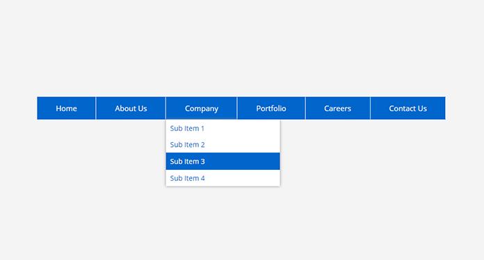
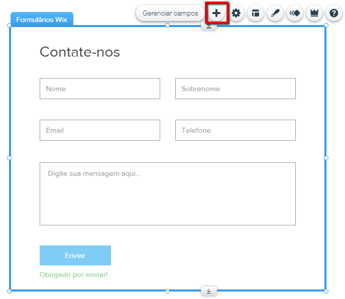

# Exercício 1

__Criar email conforme imagem abaixo:__

### Exigências

* O background do body deve estar cinza.
* O container deve ter 1000px e o menu deve estar dentro deste container.

# Exercício 2

__Criar formulário simples__

### Exigências

* O background do formulário deve estar azul claro(bem clarinho).
* O container deve ter 600px e o formulário deve preencher 100% do container.